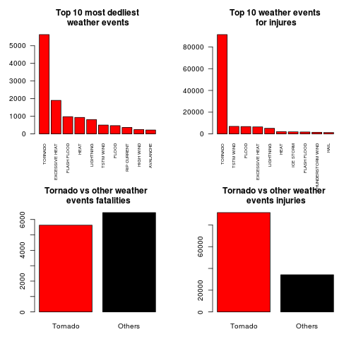
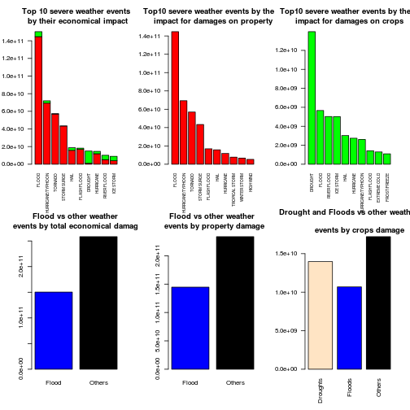

# Tornados and Floods have most dangerous impact on public health and economy

## Synopsis
Severe weather events have bad impact on the human health and the economy.
These events can result in fatalities, injuries, property and crops damages.
As a result of the analysis we found that the most dangerous weather events are ***tornadoes and floods***.
In case of impact on human population the most dangerous weather events are **tornadoes**.
The number of fatalities that **tornadoes** result are almost **the same as** the rest weather events combined.
Also tornadoes result **twice more** injuries than the rest of other weather events combined.
In case of economical impact **floods** are the most dangerous events. 
They have almost the same economical impact as all rest weather events combined.
The most dangerous weather events for crops are **droughts** and **floods**.

## Data processing
The data for this analysis come from National Weather Center in bzipped form. The archive can be downloaded from the following URL:

[https://d396qusza40orc.cloudfront.net/repdata%2Fdata%2FStormData.csv.bz2](https://d396qusza40orc.cloudfront.net/repdata%2Fdata%2FStormData.csv.bz2) 

The events in the database start in the year 1950 and end in November 2011. In the earlier years of the database there are generally fewer events recorded, most likely due to a lack of good records. More recent years should be considered more complete.

For the analysis we used the following variables:
- Event Type (EVTYPE)
- Injuries and Fatalities (INJURIES, FATALITIES)
- Property and crop damages (PROPDMG, CROPDMG)
- Property and crop damage magnitude (PROPDMGEXP, CROPDMGEXP)

To calculate the financional loss in US Dollars we need to multiply PROPDMG and CROPDMG by 10 raised to the power of variables: PROPDMGEXP, CROPDMGEXP. 


```r
#url <- "https://d396qusza40orc.cloudfront.net/repdata%2Fdata%2FStormData.csv.bz2"
#download.file(url, destfile = "repdata%2Fdata%2FStormData.csv.bz2")
dataset <- read.csv(bzfile("repdata%2Fdata%2FStormData.csv.bz2"))
df <- dataset[dataset$INJURIES!=0 | dataset$FATALITIES != 0 | dataset$PROPDMG != 0 | dataset$CROPDMG != 0, ]

## Clean dataset
## Work with levels
levels(df$CROPDMGEXP)[levels(df$CROPDMGEXP) == ""] <- 0
levels(df$CROPDMGEXP)[levels(df$CROPDMGEXP) == "?"] <- 0
levels(df$CROPDMGEXP)[levels(df$CROPDMGEXP) == "0"] <- 1
levels(df$CROPDMGEXP)[levels(df$CROPDMGEXP) == "2"] <- 100
levels(df$CROPDMGEXP)[levels(df$CROPDMGEXP) == "k"] <- 10^3
levels(df$CROPDMGEXP)[levels(df$CROPDMGEXP) == "K"] <- 10^3
levels(df$CROPDMGEXP)[levels(df$CROPDMGEXP) == "m"] <- 10^6
levels(df$CROPDMGEXP)[levels(df$CROPDMGEXP) == "M"] <- 10^6
levels(df$CROPDMGEXP)[levels(df$CROPDMGEXP) == "B"] <- 10^9

levels(df$PROPDMGEXP)[levels(df$PROPDMGEXP) == "" | levels(df$PROPDMGEXP) == "?"] <- 0
levels(df$PROPDMGEXP)[levels(df$PROPDMGEXP) == "+" | levels(df$PROPDMGEXP) == "-"] <- 0
levels(df$PROPDMGEXP)[levels(df$PROPDMGEXP) == "1"] <- 10
levels(df$PROPDMGEXP)[levels(df$PROPDMGEXP) == "0"] <- 1
levels(df$PROPDMGEXP)[levels(df$PROPDMGEXP) == "2"] <- 100 
levels(df$PROPDMGEXP)[levels(df$PROPDMGEXP) == "h"] <- 100
levels(df$PROPDMGEXP)[levels(df$PROPDMGEXP) == "H"] <- 100
levels(df$PROPDMGEXP)[levels(df$PROPDMGEXP) == "3"] <- 1000
levels(df$PROPDMGEXP)[levels(df$PROPDMGEXP) == "k"] <- 1000
levels(df$PROPDMGEXP)[levels(df$PROPDMGEXP) == "K"] <- 1000
levels(df$PROPDMGEXP)[levels(df$PROPDMGEXP) == "4"] <- 10^4
levels(df$PROPDMGEXP)[levels(df$PROPDMGEXP) == "5"] <- 10^5
levels(df$PROPDMGEXP)[levels(df$PROPDMGEXP) == "6"] <- 10^6 
levels(df$PROPDMGEXP)[levels(df$PROPDMGEXP) == "m"] <- 10^6
levels(df$PROPDMGEXP)[levels(df$PROPDMGEXP) == "M"] <- 10^6
levels(df$PROPDMGEXP)[levels(df$PROPDMGEXP) == "7"] <- 10^7
levels(df$PROPDMGEXP)[levels(df$PROPDMGEXP) == "8"] <- 10^8
levels(df$PROPDMGEXP)[levels(df$PROPDMGEXP) == "B"] <- 10^9

df$CROPDMG_FIN <- df$CROPDMG*as.numeric(levels(df$CROPDMGEXP))[df$CROPDMGEXP]
df$PROPDMG_FIN <- df$PROPDMG*as.numeric(levels(df$PROPDMGEXP))[df$PROPDMGEXP]
```

## Results
### Q1. Across the United States, which types of events (as indicated in the EVTYPE variable) are most harmful with respect to population health?

In order to answer this question we need to aggregate fatalities and injuries by event type. In both cases **tornadoes** are the most harmful weather events.


```r
## Find sum of fatalities and injuries 
dmg_hpop <- aggregate(cbind(FATALITIES, INJURIES) ~ EVTYPE, df, FUN=sum)
top10_fat<-head(dmg_hpop[order(dmg_hpop$FATALITIES, decreasing = T),1:2], n=10)
top10_inj<-head(dmg_hpop[order(dmg_hpop$INJURIES, decreasing = T),c(1,3)], n=10)
```

Top 10 weather events that result huge fatalities

```r
top10_fat
```

```
##             EVTYPE FATALITIES
## 405        TORNADO       5633
## 57  EXCESSIVE HEAT       1903
## 70     FLASH FLOOD        978
## 148           HEAT        937
## 252      LIGHTNING        816
## 423      TSTM WIND        504
## 83           FLOOD        470
## 304    RIP CURRENT        368
## 197      HIGH WIND        248
## 7        AVALANCHE        224
```

Top 10 weather events that result huge injuries

```r
top10_inj
```

```
##                EVTYPE INJURIES
## 405           TORNADO    91346
## 423         TSTM WIND     6957
## 83              FLOOD     6789
## 57     EXCESSIVE HEAT     6525
## 252         LIGHTNING     5230
## 148              HEAT     2100
## 236         ICE STORM     1975
## 70        FLASH FLOOD     1777
## 365 THUNDERSTORM WIND     1488
## 131              HAIL     1361
```

Tornadoes have the same impact on human population in fatalities as the rest weather events combined and they have twice more impact in injuries.


```r
torn_fat <- c(top10_fat$FATALITIES[1], sum(top10_fat$FATALITIES)-top10_fat$FATALITIES[1])
names(torn_fat) <- c("Tornado", "Others")

torn_inj <- c(top10_inj$INJURIES[1], sum(top10_inj$INJURIES)-top10_inj$INJURIES[1])
names(torn_inj) <- c("Tornado", "Others")

par(mfrow=c(2,2))
barplot(top10_fat$FATALITIES, names=top10_fat$EVTYPE,las=2, col="red", 
        main="Top 10 most dedliest\n weather events", cex.names=0.6)
barplot(top10_inj$INJURIES, names=top10_inj$EVTYPE,las=2, col="red", 
        main="Top 10 weather events\n for injuries", cex.names=0.6)
barplot(torn_fat, col=c("red", "black"), main="Tornado vs other weather \n events fatalities")
barplot(torn_inj, col=c("red", "black"), main="Tornado vs other weather \n events injuries")
```

 

### Q2. Across the United States, which types of events have the greatest economic consequences?

In order to answer this question we need to aggregate property and crops damages by event type. Also we need 
to calculate the sum of both of them to find the total financial loss.


```r
## Find economical impact of severe weather events
dmg_econ <- aggregate(cbind(PROPDMG_FIN, CROPDMG_FIN, PROPDMG_FIN + CROPDMG_FIN) ~ EVTYPE, 
                      df, FUN=sum)

names(dmg_econ)[4] <- "TOTAL_DMG"

### Find top10 by damages on total, property and crops
top10_total <- head(dmg_econ[order(dmg_econ$TOTAL_DMG, decreasing=T), ], n=10)
top10_prop <- head(dmg_econ[order(dmg_econ$PROPDMG_FIN, decreasing=T), c(1,2)], n=10)
top10_crop <- head(dmg_econ[order(dmg_econ$CROPDMG_FIN, decreasing=T), c(1,3)], n=10)
```

Top 10 weather events that result the biggest financial loss.

```r
top10_total
```

```
##                EVTYPE  PROPDMG_FIN CROPDMG_FIN    TOTAL_DMG
## 83              FLOOD 144657709807  5661968450 150319678257
## 222 HURRICANE/TYPHOON  69305840000  2607872800  71913712800
## 405           TORNADO  56947380676   414953270  57362333946
## 348       STORM SURGE  43323536000        5000  43323541000
## 131              HAIL  15735267513  3025954473  18761221986
## 70        FLASH FLOOD  16822673978  1421317100  18243991078
## 45            DROUGHT   1046106000 13972566000  15018672000
## 213         HURRICANE  11868319010  2741910000  14610229010
## 308       RIVER FLOOD   5118945500  5029459000  10148404500
## 236         ICE STORM   3944927860  5022113500   8967041360
```

Top 10 weather events that result the biggest property damages.

```r
top10_prop
```

```
##                EVTYPE  PROPDMG_FIN
## 83              FLOOD 144657709807
## 222 HURRICANE/TYPHOON  69305840000
## 405           TORNADO  56947380676
## 348       STORM SURGE  43323536000
## 70        FLASH FLOOD  16822673978
## 131              HAIL  15735267513
## 213         HURRICANE  11868319010
## 415    TROPICAL STORM   7703890550
## 481      WINTER STORM   6688497251
## 197         HIGH WIND   5270046295
```

Top 10 weather events that result the biggest crops damages.

```r
top10_crop
```

```
##                EVTYPE CROPDMG_FIN
## 45            DROUGHT 13972566000
## 83              FLOOD  5661968450
## 308       RIVER FLOOD  5029459000
## 236         ICE STORM  5022113500
## 131              HAIL  3025954473
## 213         HURRICANE  2741910000
## 222 HURRICANE/TYPHOON  2607872800
## 70        FLASH FLOOD  1421317100
## 63       EXTREME COLD  1292973000
## 111      FROST/FREEZE  1094086000
```

Floods and droughts result the biggest financial loss. In case of property damages the most 
dangerous events are **floods**. In case of crops loss the most dangerous events are **droughts**.
But **floods** result the biggest total damages.


```r
total_dmg <- c(top10_total$TOTAL_DMG[1], sum(top10_total$TOTAL_DMG)-top10_total$TOTAL_DMG[1])
names(total_dmg) <- c("Flood", "Others")

prop_dmg <- c(top10_prop$PROPDMG_FIN[1], sum(top10_prop$PROPDMG_FIN)-top10_prop$PROPDMG_FIN[1])
names(prop_dmg) <- c("Flood", "Others")

crop_dmg <- c(top10_crop$CROPDMG_FIN[1], 
              top10_crop$CROPDMG_FIN[2] + top10_crop$CROPDMG_FIN[3], 
              sum(top10_crop$CROPDMG_FIN)-top10_crop$CROPDMG_FIN[1]-top10_crop$CROPDMG_FIN[2]-
                top10_crop$CROPDMG_FIN[3])
names(crop_dmg) <- c("Droughts", "Floods", "Others")


### Plot the results
par(mfrow=c(2,3))
barplot(rbind(top10_total$PROPDMG_FIN, top10_total$CROPDMG_FIN), names=top10_total$EVTYPE, las=2, 
        col=c("red","green"), 
        main="Top 10 severe weather events\n by their economical impact", cex.names=0.6)

barplot(top10_prop$PROPDMG_FIN, names=top10_prop$EVTYPE, las=2, col="red", 
        main="Top10 severe weather events by their \nimpact for damages on property", cex.names=0.6)

barplot(top10_crop$CROPDMG_FIN, names=top10_crop$EVTYPE, las=2, col="green", 
        main="Top10 severe weather events by their \nimpact for damages on crops", cex.names=0.6)
barplot(total_dmg, col=c("blue", "black"), main="Flood vs other weather \n events by total economical damage")
barplot(prop_dmg, col=c("blue", "black"), main="Flood vs other weather \n events by property damage")
barplot(crop_dmg, col=c("bisque", "blue", "black"), main="Drought and Floods vs other weather \n
        events by crops damage", las=2)
```

 
